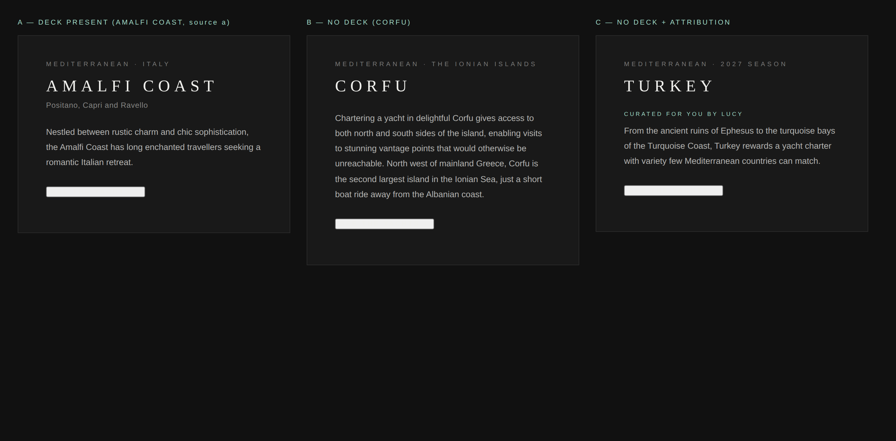

# Tier 2 destination copy — deck line and body

Branch `claude/dazzling-noether-6cqwu9` · snapshot `data/destinations.json` generated 08 September 2026 · report written 17 September 2026

Merged with `main` on 17 September 2026, which had since moved the Tier 2 client pages from `/atlas/<slug>`
to `/destinations/<slug>` and renamed `PersonalisedAtlasPage.tsx` to `DestinationsPage.tsx`. The client-page
paths below use the new route; the `/api/atlas/destinations/<id>` endpoint and the `src/**/atlas/**` module
paths are unchanged.

**Carried onto `claude/tier2-website-itineraries` on 17 September 2026.** That branch was started fresh from
`main` for the Tier 2 design handoff and only the itinerary work was cherry-picked onto it, so this change was
not on it and the composed deck lines were still showing — Dubrovnik's deck line and the opening of its body
were the same sentence. The change below is applied there unaltered; the file names in it are the current
ones. `Personalised.module.css` named further down is now `Destinations.module.css`.

## The principle

Website copy is displayed exactly as the content team wrote it. The code does not compose, truncate,
paraphrase or select fragments of copy. Where a destination's own page carries no distinct piece of copy
for a slot, the slot is left empty and nothing is rendered in its place.

## 1. Deck line

`deckLineFor()` in `src/server/atlas/content.ts` now resolves two sources, first hit wins:

| | Source | Where it comes from |
|---|---|---|
| a | Tail of `<title>` after the colon | e.g. "Amalfi Coast Yacht Charter**: Positano, Capri and Ravello**" |
| b | The "Popular destinations" key fact | the `.o-key-facts` block on the destination's page |

Removed: step 3 (child destination names joined with `·`) and step 4 (first sentence of `summary`, then
`metaDescription`). Both composed a line rather than quoting one, and step 4 was the cause of the Corfu
duplication — `summary` is the card blurb scraped from the **parent** listing page, which the content team
writes as a condensed version of the destination's own opening sentence.

The text is no longer edited: the trailing-full-stop strip (`.replace(/\.$/, "")`) is gone. Leading and
trailing whitespace is trimmed, nothing else.

When neither source resolves, `deckLineFor()` returns `undefined`, the form's DECK LINE field loads empty,
and `DestinationPanel` renders no deck element — no empty node, no placeholder, no reserved height.

### Totals across the 125 destinations in the snapshot

| Deck source | Destinations | Share |
|---|---:|---:|
| a — title tail | 45 | 36% |
| b — Popular destinations | 15 | 12% |
| **none — no deck rendered** | **65** | **52%** |

By level:

| Level | a | b | none | Total |
|---|---:|---:|---:|---:|
| 1 — region | 0 | 3 | 10 | 13 |
| 2 — country / area | 18 | 6 | 15 | 39 |
| 3 — cruising ground | 15 | 6 | 21 | 42 |
| 4 — place | 12 | 0 | 19 | 31 |

So 65 of 125 destinations lose their deck line. Every one of those was previously showing
either a composed list of child names or a paraphrase of its own opening sentence.

### Spacing in the no-deck state

`.panelHeading` carries `margin-bottom: 8px`, which was only ever enough because the deck sat beneath it
with its own `margin-bottom: 24px`. With no deck the heading would have sat 8px above the body, which reads
as broken. `.panelHeadingNoDeck` raises the heading's bottom margin to 24px, so the gap above the body is
the same 24px the deck's own margin gave it. Nothing is rendered in the deck's place. The consultant
attribution line ("CURATED FOR YOU BY …"), which sits between deck and body when the body has been edited,
keeps its own 10px margin and is unaffected.

## 2. Body

`shortIntro(dest, 2)` is replaced by `introParagraph(dest)` in `src/lib/atlas/data.ts`. The sentence-count
regex is gone; the paragraph is passed through whole. The chain is:

1. `ledeParagraphs[0]` — the first `
` of the `s-standard-content u-text-huge` block
2. `lede` — that block's paragraphs joined, for snapshots written before the importer recorded them
3. `paragraphs[0]` — the page's first body paragraph, where there is no lede block
4. `metaDescription`

`summary` is dropped from this chain.

### A parser change was needed to make "first paragraph" exact

`parsePage()` stored the lede as `lede.join(" ")` — every `
` in the lede block flattened into one string,
so the first paragraph could not be recovered. `website.mjs` now also returns `ledeParagraphs` (the array),
the importer writes it and `AtlasDestination.ledeParagraphs` is an optional field, so the existing snapshot
still typechecks and still renders through the `lede` fallback.

This was checked rather than assumed. All 125 destination pages were fetched live and re-parsed:

| Lede paragraphs on the page | Destinations |
|---|---:|
| 0 (no lede block — falls through to `paragraphs[0]`) | 26 |
| 1 | 99 |
| 2 or more | **0** |

No destination currently has a multi-paragraph lede, and the live lede matched the snapshot's byte for byte
on all 125. So the fallback to `lede` is exactly equal to `ledeParagraphs[0]` today, and **no re-import is
required**. `ledeParagraphs` only starts to matter if the content team adds a second lede paragraph; run
`npm run import:destinations` at that point (it is not run here — see section 5).

### Body length distribution (resolved body, all 125)

| | Before | After |
|---|---:|---:|
| Minimum | 25 | 99 |
| Median | 211 | 209 |
| Mean | 221 | 233 |
| Maximum | 439 | 542 |

Resolved body source, after:

| Source | Destinations |
|---|---:|
| `lede` | 99 |
| `paragraphs[0]` | 16 |
| `metaDescription` | 10 |

No destination resolves to an empty body.

### The 10 longest bodies

| Chars | Destination |
|---:|---|
| 542 | `mediterranean/turkey` |
| 520 | `north-america/bermuda` |
| 468 | `mediterranean/greece` |
| 453 | `caribbean/leeward-islands` |
| 421 | `mediterranean/italy/amalfi-coast/amalfi` |
| 394 | `mediterranean/italy/italian-riviera/portofino` |
| 383 | `mediterranean/greece/the-ionian-islands/zakynthos` |
| 378 | `mediterranean/spain/the-balearics/menorca` |
| 376 | `mediterranean/greece/the-saronic-islands/hydra` |
| 375 | `mediterranean/greece/athens` |

### Clamp decision: not added

The median body grows by -2 characters and the longest by 103 (439 to 542). At the panel's
13.5px/1.8 body style the longest case is roughly 10 lines, in an aside that already scrolls. That does not
justify a clamp, and the instruction was not to add one speculatively, so `.description` is unchanged. If
you want one after seeing it on preview, the place is `.description` in `Personalised.module.css` with an
expand control in `DestinationPanel`.

## 3. `summary` — removed from the Tier 2 panel, kept in the data model

`summary` is no longer read by anything that feeds the Tier 2 destination panel. It is still parsed
(`website.mjs`), still written by the importer and still on `AtlasDestination`, as instructed.

| File | Line | Read | In scope of the panel |
|---|---|---|---|
| `src/components/atlas/AtlasPanel.tsx` | 178 | `k.summary` — the sub-line on a Tier 1 child destination card, used when the child has no children of its own | No — Tier 1 card grid, a different surface. Left as is. |
| `src/server/atlas/website.mjs` | 212 | parses `.c-destination-card__details` from the parent page | No — importer input |
| `scripts/import-destinations.mjs` | 405 | writes `summary` into the snapshot | No — importer output |
| `src/lib/atlas/types.ts` | 45 | field declaration | No — data model |

Removed reads: `content.ts:146` (deck fallback), `content.ts:147` (body fallback) and `data.ts:174`
(`shortIntro`'s source chain).

Other matches for the word "summary" in the codebase are unrelated: HTML `
` elements in the image
pickers, `ConsultantSummary` rows, the Twitter card type and fleet-sync log lines.

## 4. Call sites and the surfaces they feed

| Function | Call site | Rendered surface |
|---|---|---|
| `atlasCopyFor()` | `src/server/atlas/content.ts:getDestinationContent()` | `/api/atlas/destinations/[id]` → the Tier 2 form's EYEBROW, DECK LINE and DESCRIPTION fields at `/portal/edit/[id]`, and from there the draft, `/portal/preview` and the published `/destinations/[slug]` |
| `atlasCopyFor()` | `src/server/demo/harrington.ts:destination()` | the demo Tier 2 page `/destinations/harrington-summer-2027` |
| `deckLineFor()` | `atlasCopyFor()` only | as above (new function, extracted from the old inline chain) |
| `introParagraph()` | `atlasCopyFor()` | as above |
| `introParagraph()` | `src/components/atlas/AtlasPanel.tsx:137` | **Tier 1** — the destination panel lede on `/2027-charter-season`, for all 125 destinations |
| `shortIntro()` | removed — no callers remain | — |

### Blast radius to review

| Surface | What changes |
|---|---|
| `/2027-charter-season` (Tier 1) | Panel lede is the whole opening paragraph rather than its first two sentences. No deck line exists on Tier 1, so the deck change does not reach it. |
| `/portal/edit/[id]` (Tier 2 form) | DECK LINE loads empty for the 65 destinations with no deck of their own; DESCRIPTION loads the whole paragraph. Existing drafts are not touched. |
| `/portal/preview` | Renders the draft, so it follows whatever the form holds. |
| `/destinations/[slug]` (published) | Unchanged for pages already published — they render their frozen config. Only the no-deck rendering and spacing are new code on this route. |
| `/destinations/harrington-summer-2027` (demo) | Its eyebrows and deck lines are consultant-written fixtures, so they do not move. Its Sardinia and Aeolian Islands bodies come from the Atlas and do change. |

Two things on Tier 1 that were deliberately **not** changed, though they are adjacent:

- `placesLine()` — the `CAPRI · POSITANO · AMALFI` line under the Tier 1 heading. This is the same composed
  child-name list that was removed from the deck chain, but on Tier 1 it is its own labelled element rather
  than a stand-in for missing copy. Out of scope; say if you want it reconsidered.
- The `k.summary` child-card sub-line described in section 3.

## 5. Existing records — no migration, no backfill

Confirmed:

- **No block with `source: "consultant"` is touched.** The change alters what `atlasCopyFor()` returns, which
  is only read when a consultant picks a destination (seeding the fields) or presses "Restore the original
  text". A consultant's own wording is never overwritten.
- **No published selection or Tier 2 page is rewritten.** Published configs are frozen at publish time and
  are rendered as stored. A page shared with a Client keeps the deck and body it was published with.
- **No saved draft is rewritten.** A draft holds its own blocks; re-opening it shows what was saved. The new
  defaults reach a draft only when a consultant picks a destination afresh or presses "Restore the original
  text" on that block.
- **No data migration, no backfill script, and `data/destinations.json` is not regenerated.** The importer
  gains a field it will write on its next run; that run is not part of this change.

Net effect: this changes only what a consultant sees when they next create a page or choose a destination,
plus the Tier 1 panel lede, which was never frozen.

## 6. Before and after

### Corfu — `mediterranean/greece/the-ionian-islands/corfu`

Level 4 · `<title>`: `Corfu - Ocean Independence` · deck source: **none**

| Line | Before | After |
|---|---|---|
| Eyebrow | MEDITERRANEAN · THE IONIAN ISLANDS | MEDITERRANEAN · THE IONIAN ISLANDS (unchanged) |
| Heading | CORFU | CORFU (unchanged) |
| Deck | Chartering a yacht in the beautiful cruising grounds of Corfu gives access to both north and south sides of the island, enabling visits to stunning vantage points that would otherwise be unreachable | **no deck element rendered** |
| Body | Chartering a yacht in delightful Corfu gives access to both north and south sides of the island, enabling visits to stunning vantage points that would otherwise be unreachable. North west of mainland Greece, Corfu is the second largest island in the Ionian Sea, just a short boat ride away from the Albanian coast. | Chartering a yacht in delightful Corfu gives access to both north and south sides of the island, enabling visits to stunning vantage points that would otherwise be unreachable. North west of mainland Greece, Corfu is the second largest island in the Ionian Sea, just a short boat ride away from the Albanian coast. (unchanged, source `lede`) |

### Amalfi Coast — `mediterranean/italy/amalfi-coast`

Level 3 · `<title>`: `Amalfi Coast Yacht Charter: Positano, Capri and Ravello` · deck source: **a**

| Line | Before | After |
|---|---|---|
| Eyebrow | MEDITERRANEAN · ITALY | MEDITERRANEAN · ITALY (unchanged) |
| Heading | AMALFI COAST | AMALFI COAST (unchanged) |
| Deck | Positano, Capri and Ravello | Positano, Capri and Ravello (unchanged) |
| Body | Nestled between rustic charm and chic sophistication, the Amalfi Coast has long enchanted travellers seeking a romantic Italian retreat. | Nestled between rustic charm and chic sophistication, the Amalfi Coast has long enchanted travellers seeking a romantic Italian retreat. (unchanged, source `paragraphs[0]`) |

Corfu is the case that prompted the change: the deck was the parent page's card blurb, a near-copy of the
body's opening sentence, and it is now gone. Its body is unchanged, because its lede was already exactly two
sentences.

Amalfi Coast is unchanged on all four lines: its title carries a colon, so the deck resolves via source a,
and it has no lede block, so the body was and is its first body paragraph.

### Also worth a look — the two demo destinations whose body moves

**Sardinia** (`mediterranean/italy/sardinia`) — body 311 → 311 chars

- Before: For yacht charter guests, Sardinia is not just a destination to experience the pinnacle of Mediterranean elegance. From lounging on the deck against a backdrop of Liscia Ruja's pink sands to exploring the vibrant streets of Cagliari by night, every aspect of Sardinia promises an unparalleled yachting vacation.
- After: For yacht charter guests, Sardinia is not just a destination to experience the pinnacle of Mediterranean elegance. From lounging on the deck against a backdrop of Liscia Ruja's pink sands to exploring the vibrant streets of Cagliari by night, every aspect of Sardinia promises an unparalleled yachting vacation.

**The Aeolian Islands** (`mediterranean/italy/sicily/aeolian-islands`) — body 167 → 167 chars

- Before: Peppering the Tyrrhenian Sea just off Sicily's northeast coast, the Aeolians are a group of seven UNESCO protected islands with volcanic origins and varied landscapes.
- After: Peppering the Tyrrhenian Sea just off Sicily's northeast coast, the Aeolians are a group of seven UNESCO protected islands with volcanic origins and varied landscapes.

## 7. Verification and the preview paths to open

The branch is pushed, so Vercel builds a preview for it. Append these paths to the preview URL.

### Needs no setup

| Path | What to look at |
|---|---|
| `/2027-charter-season` | **Tier 1.** Open Greece → The Ionian Islands → Corfu. The panel lede is now the whole opening paragraph rather than its first two sentences. This route exercises `introParagraph()` against all 125 destinations, so it is the quickest way to scan for a body that reads badly at full length. Tier 1 has no deck line, so nothing else moves here. |
| `/destinations/harrington-summer-2027` | **Tier 2 demo.** Its eyebrows and deck lines are consultant-written fixtures and do not move, but the Sardinia and Aeolian Islands bodies come from the Atlas and do. Use it to check the longer body in the real panel, at both themes. |

### Needs a test selection (I could not create it from here)

The deck states only appear on a Tier 2 page built from a draft, and creating one needs the deployed
portal's sign-in and Blob store. This container has neither, so the draft below is **not** created — please
create it on the preview, and do not publish it:

1. `/portal` → new selection → **Personalised Atlas**, consultant **Lucy**, client **Mr and Mrs Harrington**.
2. Choose these three destinations, one per slot — they cover all three deck states:

| Slot | Destination | Level | Deck source | Expected DECK LINE field |
|---|---|---|---|---|
| 1 | Greece (`mediterranean/greece`) | 2 — country | **a** — title tail | `Aegean to Ionian` |
| 2 | Turkey (`mediterranean/turkey`) | 2 — country | **b** — Popular destinations | `Marmaris · Göcek` |
| 3 | Corfu (`mediterranean/greece/the-ionian-islands/corfu`) | 4 — leaf | **none** | empty |

3. At `/portal/edit/<id>`, check the DECK LINE field is genuinely empty for Corfu and that the tag beside it
   still reads "From the website".
4. At `/portal/preview`, open each of the three destination panels. Corfu should show no deck element and no
   gap where one would have been. Stop there — do not publish.

If you would rather see the Amalfi Coast as the title-tail case instead of Greece, it resolves via a as well
(`Positano, Capri and Ravello`), but it is a cruising ground rather than a country.

### Checks already run here

- `npx tsc --noEmit` — clean.
- `npm run build` — compiles, lints and type-checks clean; all routes build.
- The app was run locally (`next dev`, `PORTAL_AUTH_PROVIDER=solo` as Lucy Oliver) and
  `/api/atlas/destinations/<id>` — the exact route the Tier 2 form calls — was queried for one destination
  per deck state. All four came back `contentSource: "live"`, so this exercised the live parse, the new
  `ledeParagraphs` field and `atlasCopyFor()` together:

| Destination | Deck source | `deckLine` in the response | `description` |
|---|---|---|---|
| Corfu | none | **key absent** — the form field loads empty, the panel renders no deck | 314 chars, whole lede paragraph |
| Amalfi Coast | a | `Positano, Capri and Ravello` | 136 chars, from `paragraphs[0]` |
| Greece | a | `Aegean to Ionian` | 468 chars |
| Turkey | b | `Marmaris · Göcek` | 542 chars — the longest body in the snapshot |

- `/2027-charter-season?destination=…/corfu` rendered in a browser: the Tier 1 panel shows the whole opening
  paragraph, followed by the "Read the full guide" link as before.
- `/destinations/harrington-summer-2027` rendered and its third tab opened: the Tier 2 panel is intact, with the
  consultant's own deck line above the Atlas body.
- All 125 destination pages fetched live and re-parsed, to establish that no lede is multi-paragraph and that
  the snapshot still matches the website (section 2).
- The three panel states rendered against the real `Personalised.module.css` in a browser and measured:

| State | Heading bottom to body top |
|---|---|
| Deck present | 46px (8px heading + deck + its 24px) |
| **No deck** | **24px** |
| No deck, with the consultant attribution line | 44px |

The no-deck state reads as deliberate rather than broken: the body sits closer under the name, with no empty
node and no reserved height. Screenshot regenerated from `reports/destination-copy-no-deck-spacing.png`.

## 8. Per-destination resolution (all 125)

`deck` is the source that resolved: **a** title tail, **b** Popular destinations, **none** no deck rendered.
`body` is the resolved body length in characters and the field it came from.

| # | Slug | Level | Deck | Deck text | Body chars | Body source |
|---:|---|---:|---|---|---:|---|
| 1 | `antarctica` | 1 | none | — | 154 | `metaDescription` |
| 2 | `antarctica/antarctica` | 2 | a | Expedition Superyacht Cruising | 291 | `lede` |
| 3 | `arctic` | 1 | none | — | 155 | `metaDescription` |
| 4 | `arctic/east-greenland` | 2 | a | Fjords, Ice and Arctic Wilderness | 259 | `lede` |
| 5 | `arctic/svalbard` | 2 | a | Arctic Glaciers and Polar Bears | 153 | `lede` |
| 6 | `australasia/australia/the-great-barrier-reef` | 3 | none | — | 323 | `lede` |
| 7 | `australia-and-new-zealand` | 1 | none | — | 154 | `metaDescription` |
| 8 | `australia-and-new-zealand/australia` | 2 | b | The Whitsundays · The Kimberley · The Great Barrier Reef | 153 | `lede` |
| 9 | `australia-and-new-zealand/australia/the-great-barrier-reef` | 3 | none | — | 323 | `lede` |
| 10 | `australia-and-new-zealand/australia/the-kimberley` | 3 | none | — | 271 | `lede` |
| 11 | `australia-and-new-zealand/australia/the-whitsundays` | 3 | none | — | 276 | `lede` |
| 12 | `australia-and-new-zealand/new-zealand` | 2 | none | — | 281 | `lede` |
| 13 | `caribbean` | 1 | b | The Bahamas · The Windward Islands · The Leeward Islands · Br… | 304 | `lede` |
| 14 | `caribbean/leeward-islands` | 2 | b | St Maarten · St Barts · Antigua | 453 | `paragraphs[0]` |
| 15 | `caribbean/leeward-islands/antigua` | 3 | none | — | 179 | `lede` |
| 16 | `caribbean/leeward-islands/st-barts` | 3 | none | — | 171 | `lede` |
| 17 | `caribbean/leeward-islands/st-maarten` | 3 | none | — | 230 | `lede` |
| 18 | `caribbean/the-bahamas` | 2 | a | Explore Islands & Routes 2026 | 287 | `lede` |
| 19 | `caribbean/the-bahamas/abaco-islands` | 3 | a | Bahamas Cays, Reefs, Bays | 162 | `lede` |
| 20 | `caribbean/the-bahamas/bimini-islands` | 3 | a | Bahamas Reefs, Wrecks and Big Game | 189 | `lede` |
| 21 | `caribbean/the-bahamas/grand-bahama` | 3 | none | — | 130 | `lede` |
| 22 | `caribbean/the-bahamas/nassau` | 3 | none | — | 163 | `lede` |
| 23 | `caribbean/the-bahamas/the-exumas` | 3 | none | — | 211 | `lede` |
| 24 | `caribbean/the-windward-islands` | 2 | a | From St Lucia to Grenada | 184 | `lede` |
| 25 | `caribbean/the-windward-islands/st-vincent-the-grenadines` | 3 | b | Martinique · Dominica | 300 | `lede` |
| 26 | `caribbean/the-windward-islands/st-vincent-the-grenadines/dominica` | 4 | none | — | 309 | `lede` |
| 27 | `caribbean/the-windward-islands/st-vincent-the-grenadines/martinique` | 4 | none | — | 194 | `lede` |
| 28 | `caribbean/virgin-islands` | 2 | a | Explore the BVI and USVI | 170 | `lede` |
| 29 | `caribbean/virgin-islands/british-virgin-islands` | 3 | a | Baths to Anegada | 141 | `paragraphs[0]` |
| 30 | `caribbean/virgin-islands/us-virgin-islands` | 3 | a | St Thomas and St John | 230 | `paragraphs[0]` |
| 31 | `central-america` | 1 | b | Costa Rica · Mexico · Belize | 302 | `paragraphs[0]` |
| 32 | `central-america/belize` | 2 | none | — | 258 | `lede` |
| 33 | `central-america/costa-rica` | 2 | none | — | 184 | `paragraphs[0]` |
| 34 | `central-america/mexico` | 2 | none | — | 119 | `lede` |
| 35 | `indian-ocean` | 1 | none | — | 153 | `metaDescription` |
| 36 | `indian-ocean/maldives` | 2 | none | — | 202 | `lede` |
| 37 | `indian-ocean/seychelles` | 2 | none | — | 193 | `lede` |
| 38 | `indian-ocean/tanzania` | 2 | none | — | 205 | `lede` |
| 39 | `mediterranean` | 1 | b | France · Italy · Croatia · Greece · Spain | 113 | `lede` |
| 40 | `mediterranean/croatia` | 2 | a | Dubrovnik, Hvar & the Adriatic | 179 | `paragraphs[0]` |
| 41 | `mediterranean/croatia/dubrovnik` | 3 | none | — | 199 | `lede` |
| 42 | `mediterranean/croatia/hvar` | 3 | none | — | 126 | `lede` |
| 43 | `mediterranean/cyprus` | 2 | b | Limassol | 252 | `lede` |
| 44 | `mediterranean/cyprus/limassol` | 3 | none | — | 146 | `lede` |
| 45 | `mediterranean/france` | 2 | a | Riviera & Islands | 180 | `lede` |
| 46 | `mediterranean/france/corsica` | 3 | b | Calvi | 162 | `lede` |
| 47 | `mediterranean/france/corsica/calvi` | 4 | a | Corsican Citadel, Bays and Beaches | 171 | `lede` |
| 48 | `mediterranean/france/french-riviera` | 3 | a | Cannes, Antibes, St Tropez | 243 | `lede` |
| 49 | `mediterranean/france/french-riviera/antibes` | 4 | a | Old Town, Cap and Superyacht Quay | 243 | `lede` |
| 50 | `mediterranean/france/french-riviera/cannes` | 4 | a | The Croisette, Lerins and Festivals | 99 | `lede` |
| 51 | `mediterranean/france/french-riviera/cap-ferrat` | 4 | none | — | 192 | `lede` |
| 52 | `mediterranean/france/french-riviera/eze` | 4 | a | Riviera Hilltop Village and Coastline | 366 | `lede` |
| 53 | `mediterranean/france/french-riviera/monaco` | 4 | a | Port Hercule, Grand Prix and More | 207 | `lede` |
| 54 | `mediterranean/france/french-riviera/porquerolles` | 4 | none | — | 179 | `lede` |
| 55 | `mediterranean/france/french-riviera/st-tropez` | 4 | none | — | 177 | `lede` |
| 56 | `mediterranean/france/french-riviera/villefranche` | 4 | none | — | 290 | `lede` |
| 57 | `mediterranean/greece` | 2 | a | Aegean to Ionian | 468 | `paragraphs[0]` |
| 58 | `mediterranean/greece/athens` | 3 | none | — | 375 | `lede` |
| 59 | `mediterranean/greece/crete` | 3 | none | — | 178 | `lede` |
| 60 | `mediterranean/greece/the-cyclades` | 3 | a | Sail Mykonos, Santorini, Paros | 135 | `lede` |
| 61 | `mediterranean/greece/the-cyclades/mykonos` | 4 | a | Cyclades Beaches, Bays, Nightlife | 254 | `paragraphs[0]` |
| 62 | `mediterranean/greece/the-cyclades/santorini` | 4 | none | — | 198 | `lede` |
| 63 | `mediterranean/greece/the-dodecanese` | 3 | a | Rhodes, Kos, Symi and Patmos | 297 | `lede` |
| 64 | `mediterranean/greece/the-ionian-islands` | 3 | a | Corfu, Kefalonia and Zante | 295 | `lede` |
| 65 | `mediterranean/greece/the-ionian-islands/corfu` | 4 | none | — | 314 | `lede` |
| 66 | `mediterranean/greece/the-ionian-islands/zakynthos` | 4 | none | — | 383 | `paragraphs[0]` |
| 67 | `mediterranean/greece/the-saronic-islands` | 3 | b | Spetses · Hydra | 225 | `lede` |
| 68 | `mediterranean/greece/the-saronic-islands/hydra` | 4 | none | — | 376 | `paragraphs[0]` |
| 69 | `mediterranean/greece/the-saronic-islands/spetses` | 4 | none | — | 227 | `paragraphs[0]` |
| 70 | `mediterranean/italy` | 2 | a | Amalfi Coast, Sicily & Sardinia | 217 | `lede` |
| 71 | `mediterranean/italy/amalfi-coast` | 3 | a | Positano, Capri and Ravello | 136 | `paragraphs[0]` |
| 72 | `mediterranean/italy/amalfi-coast/amalfi` | 4 | none | — | 421 | `paragraphs[0]` |
| 73 | `mediterranean/italy/amalfi-coast/capri` | 4 | none | — | 247 | `paragraphs[0]` |
| 74 | `mediterranean/italy/amalfi-coast/positano` | 4 | none | — | 355 | `paragraphs[0]` |
| 75 | `mediterranean/italy/bari` | 3 | a | Puglia and the Southern Adriatic Sea | 239 | `lede` |
| 76 | `mediterranean/italy/ischia` | 3 | none | — | 184 | `lede` |
| 77 | `mediterranean/italy/italian-riviera` | 3 | a | Portofino, Genoa, Liguria | 265 | `lede` |
| 78 | `mediterranean/italy/italian-riviera/cinque-terre` | 4 | a | Five Ligurian Villages by Sea | 201 | `lede` |
| 79 | `mediterranean/italy/italian-riviera/genoa` | 4 | a | Ligurian Capital and Riviera Coast | 313 | `lede` |
| 80 | `mediterranean/italy/italian-riviera/lerici` | 4 | none | — | 283 | `lede` |
| 81 | `mediterranean/italy/italian-riviera/portofino` | 4 | a | Ligurian Harbour and Coastline | 394 | `lede` |
| 82 | `mediterranean/italy/naples` | 3 | b | Pontine Islands | 179 | `lede` |
| 83 | `mediterranean/italy/naples/pontine-islands` | 4 | none | — | 280 | `lede` |
| 84 | `mediterranean/italy/ravenna` | 3 | none | — | 214 | `lede` |
| 85 | `mediterranean/italy/sardinia` | 3 | b | Olbia | 311 | `lede` |
| 86 | `mediterranean/italy/sardinia/olbia` | 4 | a | Gateway to the Costa Smeralda Coast | 313 | `lede` |
| 87 | `mediterranean/italy/sicily` | 3 | b | The Aeolian Islands | 306 | `lede` |
| 88 | `mediterranean/italy/sicily/aeolian-islands` | 4 | a | Stromboli and Volcanoes | 167 | `lede` |
| 89 | `mediterranean/italy/venice` | 3 | a | Cruise the Lagoon and the Adriatic | 164 | `lede` |
| 90 | `mediterranean/malta` | 2 | a | Valletta, Gozo and the Blue Lagoon | 288 | `lede` |
| 91 | `mediterranean/montenegro` | 2 | b | Kotor · Budva | 176 | `lede` |
| 92 | `mediterranean/montenegro/budva` | 3 | none | — | 171 | `lede` |
| 93 | `mediterranean/montenegro/kotor` | 3 | none | — | 213 | `lede` |
| 94 | `mediterranean/spain` | 2 | a | Balearics, Costa Brava and Andalusia | 172 | `lede` |
| 95 | `mediterranean/spain/the-balearics` | 3 | a | Mallorca, Ibiza and Formentera | 140 | `lede` |
| 96 | `mediterranean/spain/the-balearics/formentera` | 4 | none | — | 141 | `lede` |
| 97 | `mediterranean/spain/the-balearics/ibiza` | 4 | none | — | 173 | `lede` |
| 98 | `mediterranean/spain/the-balearics/mallorca` | 4 | a | Palma, Formentor and Quiet Calas | 177 | `lede` |
| 99 | `mediterranean/spain/the-balearics/menorca` | 4 | none | — | 378 | `lede` |
| 100 | `mediterranean/spain/valencia` | 3 | none | — | 269 | `lede` |
| 101 | `mediterranean/turkey` | 2 | b | Marmaris · Göcek | 542 | `paragraphs[0]` |
| 102 | `mediterranean/turkey/gocek` | 3 | a | Twelve Islands on the Lycian Coast | 209 | `lede` |
| 103 | `mediterranean/turkey/marmaris` | 3 | a | Turkish Riviera Natural Harbour | 279 | `lede` |
| 104 | `middle-east` | 1 | none | — | 147 | `metaDescription` |
| 105 | `middle-east/the-red-sea` | 2 | a | Reef Diving and Year-Round Sunshine | 336 | `lede` |
| 106 | `north-america` | 1 | none | — | 153 | `metaDescription` |
| 107 | `north-america/alaska` | 2 | none | — | 209 | `lede` |
| 108 | `north-america/bermuda` | 2 | none | — | 520 | `lede` |
| 109 | `north-america/florida` | 2 | a | The Keys, Gulf Coast and Biscayne | 211 | `lede` |
| 110 | `north-america/new-england` | 2 | none | — | 349 | `lede` |
| 111 | `northern-europe` | 1 | none | — | 154 | `metaDescription` |
| 112 | `northern-europe/norway` | 2 | a | Fjords, Glaciers and Midnight Sun | 300 | `lede` |
| 113 | `south-america` | 1 | none | — | 150 | `metaDescription` |
| 114 | `south-america/chile` | 2 | none | — | 158 | `lede` |
| 115 | `south-america/ecuador` | 2 | b | The Galapagos Islands | 243 | `lede` |
| 116 | `south-america/ecuador/galapagos-islands` | 3 | none | — | 304 | `lede` |
| 117 | `south-america/patagonia` | 2 | a | Fjords, Glaciers and Wild Coast | 144 | `lede` |
| 118 | `south-east-asia` | 1 | none | — | 154 | `metaDescription` |
| 119 | `south-east-asia/indonesia` | 2 | none | — | 370 | `lede` |
| 120 | `south-east-asia/malaysia` | 2 | none | — | 236 | `lede` |
| 121 | `south-east-asia/thailand` | 2 | none | — | 164 | `lede` |
| 122 | `south-pacific` | 1 | none | — | 149 | `metaDescription` |
| 123 | `south-pacific/fiji` | 2 | a | Cruise Coral Reefs and Private Isles | 157 | `lede` |
| 124 | `south-pacific/french-polynesia` | 2 | none | — | 208 | `lede` |
| 125 | `south-pacific/new-caledonia` | 2 | a | The Largest Lagoon on Earth | 168 | `lede` |

