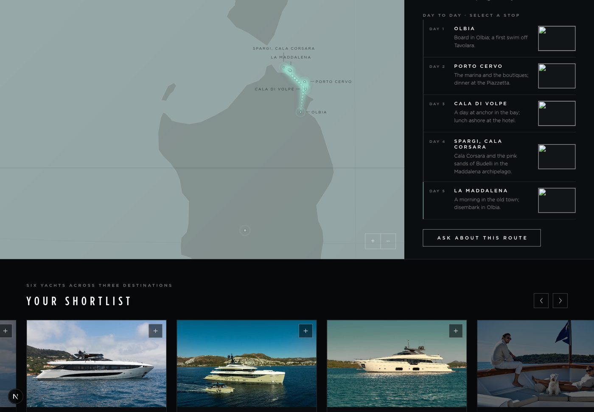
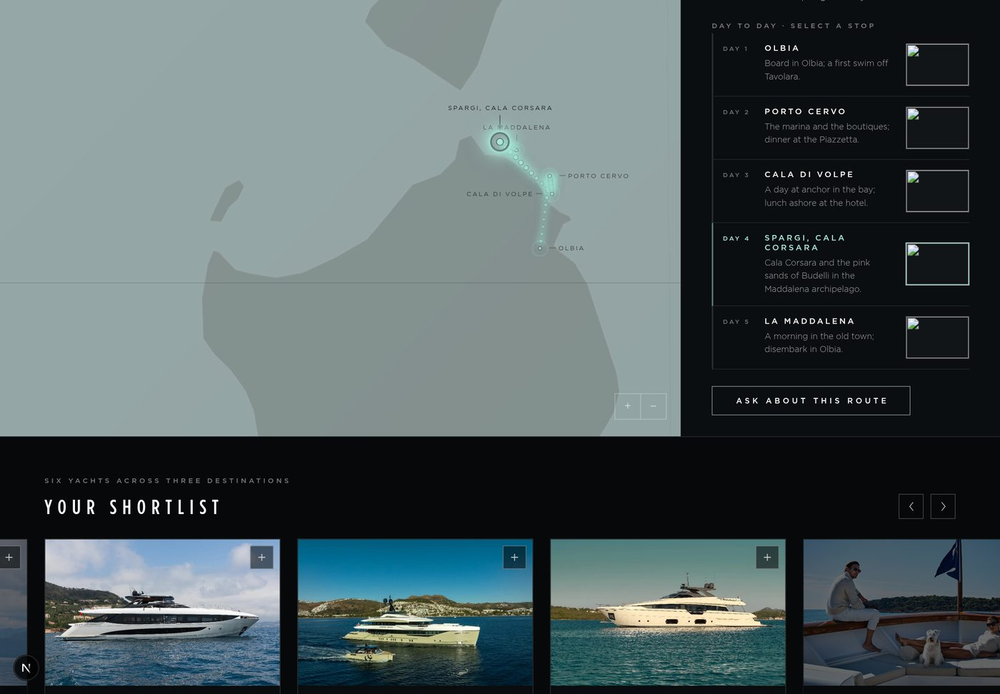
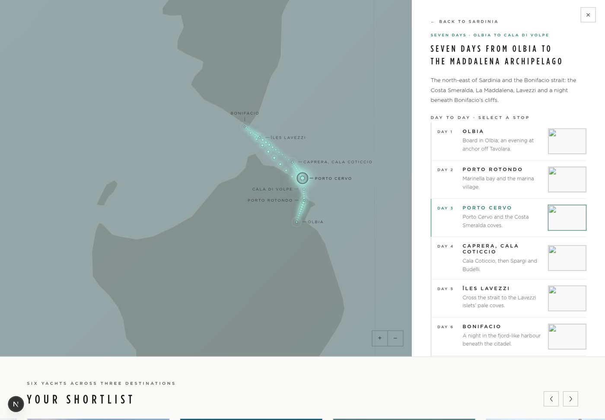

# Tier 2 — website itineraries on the globe, peek carousel, contact fallback

Branch `claude/tier2-website-itineraries`, off `main` at `253acb0`, 17 September 2026.
Implements the Tier 2 design handoff (`design_handoff_tier2_atlas/tier2-atlas-prompt.md`, §1–§8)
into the production `DestinationsPage`, with the decisions taken in review recorded below.

## Decisions taken in review

| Question | Decision |
|---|---|
| Itinerary content | The repo-held library from PR #22 (`content/itineraries/`, one JSON per destination, coordinates included), sourced from the website. |
| PR #22 | Only its itinerary pieces are taken (below); the fleet page and Tier 1 restructure are not. PR #22 itself is untouched. |
| Existing "Suggested itinerary" links section | Kept alongside. Consultants can switch either off: the links section as before, the website itineraries with a new Page Sections toggle. |
| Other Atlas pins | Stay hidden on Tier 2 (`SHOW_OTHER_PINS` unchanged). |
| Images | Three per destination in a peek carousel; pages already published with two render a two-slide carousel. Stop thumbnails reuse Atlas imagery. |
| Itineraries per destination | Up to three (`MAX_WEBSITE_ITINERARIES`); the library holds at most two today. |
| Contact CTA | WhatsApp with a prefilled message; where the consultant has no WhatsApp number, EMAIL ME (mailto with the same words as the subject). Applied to the consultant block on every tier as well. |
| Brochure link | Unchanged: the consultant-typed URL per yacht. |
| Paragraph label | Unchanged — the FROM THE 2027 ATLAS label in the screenshots is not implemented, as instructed. |

## Taken from PR #22 (`claude/atlas-restructure-itineraries-fleet`)

Copied as files, not merged — PR #22 is 121 commits behind main and conflicts in six files.

| File | Role |
|---|---|
| `content/itineraries/*.json` (125 files) | The library: `{ destinationId, status, itineraries: [{ id, nights, title, intro, days: [{ day, place, lat, lng, note }] }] }`. All 125 are `status: "placeholder"`; the status never reaches the page. |
| `scripts/build-itineraries.mjs` | Validates the files (ids, day numbering, coordinates), flags legs over 120 nm, writes `data/itineraries.json` and the coverage table. The coverage document now lands at `docs/itinerary-coverage.md` (PR #22 wrote to a `design/` folder main does not have). |
| `data/itineraries.json` | The aggregate the app imports. 113 destinations with routes, 221 itineraries, 1,321 stops. Regenerated on every `npm run build` (prebuild), so its `generatedAt` changes with each build. |
| `src/lib/atlas/itineraries.ts` | The shared types and client loader. |

Not taken: PR #22's `globe.ts` route rendering (a different approach from the design's DOM dots), its
website itinerary-page parser, the fleet page, the Tier 1 panel and AtlasPage changes.

`package.json`: `build:itineraries` added; `prebuild` runs the consultants seed then the itinerary build.

## Ported from the design's globe (`atlas-globe-3d.js`) into `src/lib/atlas/globe.ts`

- **`setRoute(points | null)`** — a `THREE.Line` hairline per leg (`#257D6B`, opacity 0.2, `depthTest: false`,
  `renderOrder: 5`, 24 segments per leg so it follows the sphere) under a trail of **DOM dots**: nine per leg,
  5px mint with the design's layered `box-shadow`, in a dedicated layer between the canvas and the pins.
  Positions are projected every frame (`applyMatrix4(yawG.matrixWorld)` → `project(camera)`), so they track
  rotation and zoom and hold their screen size. Opacity and scale run off `sin(t · 1.5 − i · 0.45)`, a slow
  flow along the route. Dots fade past the horizon with the pins' limb test, and are created at `opacity: 0`.
- **`setViewShift(px)`** — `camera.setViewOffset` so the globe frames its subject in the part of the stage a
  side panel leaves uncovered; cleared with 0.
- **Selected stop** — a sub-pin grows to a 9px solid disc under the design's four-layer glow over 240ms.
- **Zoom range** — configurable upper limit (`GlobeConfig.zoomMax`); Tier 2 passes 80, the Atlas keeps 8.
- **Robustness** — the frame loop runs in `try / catch / finally`: a transient error costs one frame, not the
  globe. Logged at most every two seconds.

`AtlasGlobe.tsx` exposes `setRoute` and `setViewShift` on the handle (replayed if called before the engine is
ready) and a `zoomMax` prop.

## The page (`DestinationsPage.tsx`, `Destinations.module.css`)

**Destination state**: eyebrow, name, deck line, paragraph (labels unchanged), the consultant's note, the
**peek carousel** (§2: 82% slides, 10px gap, scroll-snap, native swipe on touch, pointer drag on desktop with
snap disabled during the drag and re-enabled on release, arrows stepping exactly one slide, a counter derived
from `scrollLeft`), SEE THE YACHTS ↓, then the **itinerary cards** (§3: count-aware SAMPLE ITINERARY /
ITINERARIES heading; each card `<N> DAYS · <FIRST> TO <LAST>` or `· <PORT> RETURN`, the title, the stops
joined with `·`, VIEW ROUTE ON THE MAP →). The old two-image grid is gone.

**Itinerary state** replaces the body in place (§1): ← BACK TO ⟨DESTINATION⟩, the days eyebrow, the title, the
route's own paragraph, DAY TO DAY · SELECT A STOP, one row per stop (44px day column, name, note, 92 × 62
thumbnail; 2px left rule and thumbnail border turn mint when selected), then the contact button.

**Globe choreography** (§5): opening a route sets sub-pins and the route, focuses the stop pins and flies to
`fitRoute` (mean centre, `zoom = clamp(1.15 / angularSpan, 4, 34)`); selecting a stop flies to
`clamp(fitZoom × 2.2, 18, 48)` over 1,250ms; an ocean tap releases a selected stop and re-fits, and closes
the panel only when no route is open; selecting another destination, a yacht, or closing the panel clears
the route. The view shift is half the panel width whenever a panel is open and the remaining stage is under
560px wide, re-evaluated on resize, and never on the ≤ 420px bottom-sheet layout, which covers no width.

**Stage chrome**: the zoom cluster moves to `calc(min(460px, 88vw) + 20px)` while the panel is open and sits
above it in z-order; the hint gains its second line (DRAG TO TURN · SELECT A DESTINATION) and fades to
`visibility: hidden` while a destination is open. The panel is `min(460px, 88vw)` wide, as in the design.

**Light theme**: shares all geometry; the deep-teal `#257D6B` stands in for mint on eyebrows, the selected
stop's rule, name and thumbnail border.

## Data model

| Type | Change |
|---|---|
| `DestinationsPageDestination.images` | `[AtlasBlock, AtlasBlock]` → `AtlasBlock[]` (two or three, blanks dropped at mapping). |
| `DestinationsPageDestination.itineraries?` | `DestinationsPageItinerary[]`, frozen at publish: `{ id, title, nights, intro, stops: [{ day, place, lat, lon, note, image? }] }`. |
| `DestinationsPageSections.routes?` | The Website itineraries toggle. Absent on older pages, which carry no itineraries anyway. |
| `Tier2DestinationDraft.images` | `ContentBlock[]`; the form pads a two-image draft to three on load, using the next Atlas candidate. |
| `Tier2DestinationDraft.websiteItineraries?` | Read-only summary shown in the form under the destination. |
| `Tier2Sections.routes` | Default `true` (`TIER2_DEFAULT_SECTIONS`). |
| `AtlasDestinationContent.itineraries` | The summary the destination API returns. |
| `AtlasResolution.itineraries` | What the mapping freezes, per chosen destination id. |

## Resolution (`src/server/atlas/content.ts`)

`atlasResolutionFor(chosenIds)` now returns `itineraries` alongside coordinates and pins, so preview, publish
and the demo page share one path. `itinerariesFor(id)` reads the aggregate and resolves a thumbnail per stop:

- **Stop thumbnails** (`stopImageFor`): the stop's name is matched to an Atlas destination — ignoring case,
  accents, hyphens, a leading "The", with "Saint" read as "St", and trying the part before a comma
  ("St Barts, Gustavia") — and that destination's card or hero image is used (Sirv renditions at 400px; other
  hosts as-is). Nothing looser: a substring match would give Fort-de-France the image of France.
- Where no Atlas destination matches, the mapping (`destinations-map.ts`) gives the stop one of the
  destination's own carousel images, rotating through them, so a day list is never ragged.

Across the whole library, **291 of 1,321 stops (22%) get an Atlas thumbnail**; 1,030 borrow a carousel image.
The Amalfi Coast routes match well (Capri, Positano, Sorrento, Ischia…); the Aeolian and Sardinian anchorages
mostly do not, because the Atlas has no page for Panarea or Cala di Volpe. If per-stop photography is wanted
later, an `image` field on a day in the library file is the natural place; the mapping already prefers a
stop's own image.

## The form (`Tier2Form.tsx`)

- THREE IMAGES per destination (was two): the third seeds from the next Atlas candidate.
- Under each destination, SAMPLE ITINERARIES lists the routes the client page will draw, read-only, or says
  the website has none for this destination.
- Page Sections: **Website itineraries** checkbox (`sections.routes`), default on. The existing Suggested
  itinerary checkbox and its links stay.

## Contact fallback (`format.ts` `contactCta`, `ConsultantBlock.tsx`)

`contactCta(consultant, message, labels)` returns a WhatsApp link with `?text=` (appended correctly to a
`wa.me` URL with or without a query) when the consultant has a number, else a `mailto:` with the message as
the subject and the EMAIL ME label, else null. Used by the route CTA (ASK ABOUT THIS ROUTE / EMAIL ME ABOUT
THIS ROUTE, message `Hello ⟨first name⟩, I would like to talk about "⟨route title⟩" for summer 2027.`) and
by the consultant block at the foot of every client page on both tiers (WHATSAPP ME / EMAIL ME, message
`Summer 2027 options`).

## Published pages and drafts

- No migration, no backfill. Pages already published render as they were: two images become a two-slide
  carousel; no `itineraries` on the config means no cards. Nothing is re-read from the library at render time.
- Drafts saved with two images open with three; consultant-edited blocks are untouched.
- The demo draft (`harrington.ts`) carries three images and `routes: true`, so
  `/destinations/harrington-summer-2027` shows all of it.

## Verification

- `npx tsc --noEmit` and a full `npm run build` (both prebuild steps included) — clean.
- `npm run build:itineraries` — 125 files, 221 itineraries, no validation problems; three long-leg warnings
  (Antarctica ×2, Chile), listed in `docs/itinerary-coverage.md`.
- The app run locally (`PORTAL_AUTH_PROVIDER=solo` as Lucy Oliver) and driven in Chromium on
  `/destinations/harrington-summer-2027`: Sardinia → its first itinerary → day four → back, at 1440px, then
  at 900px, then with the light theme applied. Observed: three carousel slides, counter 1 / 3 → 2 / 3 on the
  arrow; hint at opacity 0 and hidden while open; two itinerary cards; on opening, 36 route dots (four legs
  × nine) all visible and pulsing, five labelled stop pins beside the three destination pins, the camera on
  the route fit; on selecting day four, the row's rule and thumbnail turn mint and the camera flies in; the
  CTA reads ASK ABOUT THIS ROUTE and links to `wa.me/41440000000?text=Hello%20Lucy%2C%20I%20would%20like…`;
  BACK TO SARDINIA restores the destination body and removes every dot. No page errors. The only console
  entries were the sandbox refusing the Sirv CDN's certificate, which is why the screenshots show alt text
  in the image slots.
- `/2027-charter-season` (Tier 1) loads and opens a destination with no errors; its zoom limit is unchanged.
- `/api/atlas/demo` returns three images per destination, every demo stop with an image, `sections.routes: true`.

## To check on preview

1. `/destinations/harrington-summer-2027` — open Sardinia; swipe or drag the carousel; open each route; select
   stops; tap the ocean; press BACK; switch destination while a route is open; open a yacht from the rail
   while a route is open (the route clears).
2. The same at a window under about 1,000px wide, where the view shift keeps the route left of the panel,
   and on a phone (≤ 420px), where the panel is the bottom sheet and no shift applies.
3. `/portal` → a Personalised Atlas for Lucy and Mr and Mrs Harrington: three image slots, the SAMPLE
   ITINERARIES summary under a destination, the Website itineraries toggle. Preview with it on and off.
   Do not publish it.
4. Any Tier 3 page whose consultant has no WhatsApp number: the foot button reads EMAIL ME.

## Not done, and why

- The itinerary copy is the library's, all files still `status: "placeholder"`; approving is editorial work
  in `content/itineraries/`, not code.
- Per-stop photography beyond the Atlas match (22% of stops) needs images the repo does not have.
- The destination-copy change (deck line and body, PR #56) is on `claude/dazzling-noether-6cqwu9`, not
  here; it touches `DestinationPanel` too, so whichever lands second needs a small merge.
