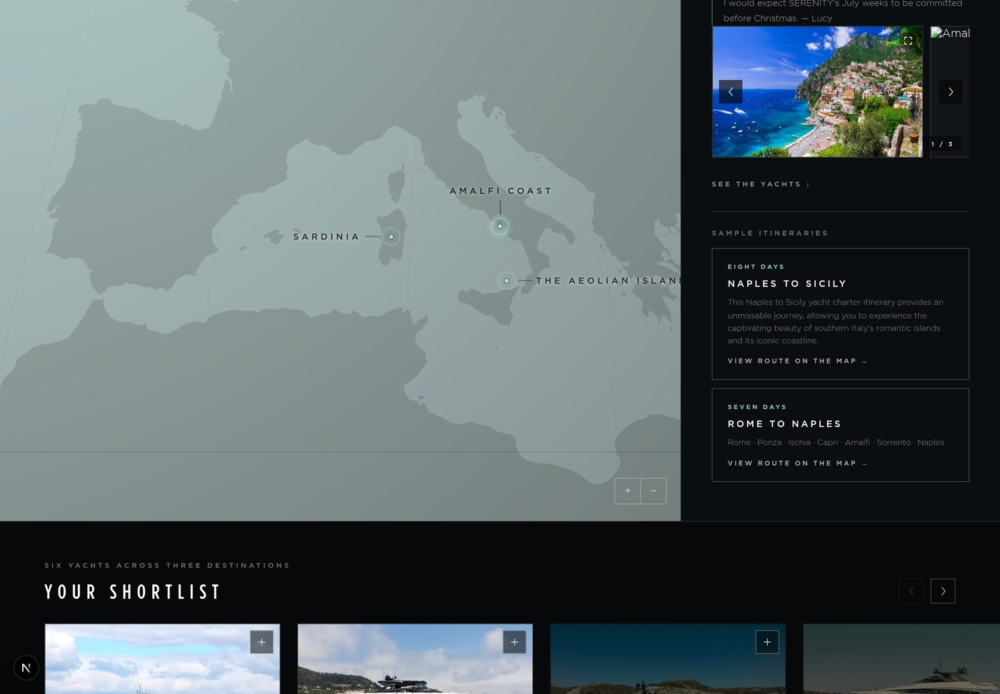

# Tier 2 — website itineraries on the globe, peek carousel, contact fallback

Branch `claude/tier2-website-itineraries`, off `main` at `253acb0`, 17 September 2026.
Implements the Tier 2 design handoff (`design_handoff_tier2_atlas/tier2-atlas-prompt.md`, §1–§8)
into the production `DestinationsPage`, with the decisions taken in review recorded below.

## Decisions taken in review

| Question | Decision |
|---|---|
| Itinerary content | The website's own itinerary pages, captured verbatim (PR #22's crawl). Its placeholder library is not used. |
| PR #22 | Only its itinerary crawl is taken (below); the fleet page and Tier 1 restructure are not. PR #22 itself is untouched. |
| Existing "Suggested itinerary" links section | Kept alongside. Consultants can switch either off: the links section as before, the website itineraries with a new Page Sections toggle. |
| Other Atlas pins | Stay hidden on Tier 2 (`SHOW_OTHER_PINS` unchanged). |
| Images | Three per destination in a peek carousel; pages already published with two render a two-slide carousel. Stop thumbnails reuse Atlas imagery. |
| Itineraries per destination | Up to three (`MAX_WEBSITE_ITINERARIES`), whichever the website's pages give. |
| Contact CTA | WhatsApp with a prefilled message; where the consultant has no WhatsApp number, EMAIL ME (mailto with the same words as the subject). Applied to the consultant block on every tier as well. |
| Brochure link | Unchanged: the consultant-typed URL per yacht. |
| Paragraph label | Unchanged — the FROM THE 2027 ATLAS label in the screenshots is not implemented, as instructed. |

## Where the itineraries come from

The website's own itinerary pages, not the placeholder library. PR #22's crawl of
`/yacht-charter/itineraries/` is the source; its placeholder JSON files are not used and are
not on this branch.

| Piece | What it is |
|---|---|
| `data/destinations.json` → `itineraries` | **32 website itinerary pages, verbatim**: title, length, intro paragraphs, the DAY TO DAY headings and their narrative, hero image and the page's map pins. Refreshed by `npm run import:itineraries` (this branch's parser, on PR #22's `parseItineraryPage`). |
| `data/destinations.json` → each destination's `itineraryLinks` | Which itineraries a destination page links to, with the card blurb. 75 of 125 destinations link to at least one. |
| `content/itinerary-stops.json` | The **located places** of each day heading — `npm run geocode:itineraries`, reviewed by hand. |
| `data/itineraries.json` | The join, per destination — `npm run build:itineraries`, also a prebuild step. |
| `docs/itinerary-coverage.md`, `docs/itinerary-stops-review.md` | What each destination draws, every day and its coordinates, and every gap. |

### The problem the geocoding solves

The website writes a day as a **leg**, not a stop — "Bonifacio - Maddalena Islands", "Day One -
Three  Nassau to Compass Cay", "Return To Sopers Hole Marina, Tortola" — and its map carries only
the start and end pins. So a heading is split into its places (`legPlaces`) and each is located:
from the itinerary's own map pins, then the Atlas destinations, then Nominatim. A route is
sequential, so among Nominatim's candidates **the one nearest the previous located place wins** —
that is what tells Maratea in Basilicata, an afternoon from Capri, from the Maratea in Sicily.

Nothing is geocoded at build or run time, and `--refresh` aside, a coordinate corrected by hand in
the JSON survives every re-run.

### Coverage, honestly

| | |
|---|---|
| Website itinerary pages captured | 32 |
| Day headings | 234 |
| Places named in them | 364 |
| Located and drawn | 300 (81 from the page's own map pins, 23 Atlas destinations, 162 Nominatim, **31 corrected by hand**) |
| Not drawn | 64 — 43 Nominatim could not resolve, 21 it placed outside the itinerary's own area |
| Itineraries drawable | 31 of 32 |
| Destinations with at least one route | **91 of 125** |

A day whose places could not be located **keeps its row and its narrative** and simply draws no
pin; the route runs from the previous located day to the next. An itinerary is dropped only when
fewer than two of its places are located (one: "Fiji Itinerary").

Two safeguards sit in the build, because a wrong coordinate is worse than a missing one: a place
the geocoder could not put near the itinerary's own map pins is recorded but **not drawn**
(`nominatim-far`), and a place far from the median of the route's own places is dropped as an
outlier. Both are listed in `docs/itinerary-coverage.md`, 32 entries at present.

I corrected 31 entries by hand across the eight Mediterranean itineraries (Li Galli was landing in
the Canaries, Maratea in Sicily, Lefkada in Cyprus), so **no Mediterranean route now has a leg over
300 km**. Thirteen legs elsewhere still exceed it — la Paz, St Thomas, Langkawi, and the polar
routes, where several are real ocean crossings and several are not. They are in the coverage
document for review; correcting one is an edit to `content/itinerary-stops.json`, no re-crawl.

### How a destination gets its itineraries

In order, up to three:

1. the itineraries its **own website page** links to;
2. for a place (level 4) with none, its **cruising ground's**;
3. the itineraries that **sail there** — at least two located stops inside the destination's radius
   (260 km for a country, 150 km for a cruising ground, 60 km for a place), most stops first.

Rule 3 is what gives Sardinia the Corsica-and-Sardinia route its own page does not link to, and it
takes the count from 76 to 91 destinations. Nothing is inherited downward from a country or a
region, whose itineraries cover other coasts. The coverage document names the rule that applied to
each destination.

## Ported from the design's globe (`atlas-globe-3d.js`) into `src/lib/atlas/globe.ts`

- **`setRoute(points | null)`** — a `THREE.Line` hairline per leg (`#257D6B`, opacity 0.2, `depthTest: false`,
  `renderOrder: 5`, 24 segments per leg so it follows the sphere) under a trail of **DOM dots**: nine per leg,
  5px mint with the design's layered `box-shadow`, in a dedicated layer between the canvas and the pins.
  Positions are projected every frame (`applyMatrix4(yawG.matrixWorld)` → `project(camera)`), so they track
  rotation and zoom and hold their screen size. Opacity and scale run off `sin(t · 1.5 − i · 0.45)`, a slow
  flow along the route. Dots fade past the horizon with the pins' limb test, and are created at `opacity: 0`.
- **`setViewShift(px)`** — `camera.setViewOffset` so the globe frames its subject in the part of the stage a
  side panel leaves uncovered; cleared with 0.
- **Selected stop** — a sub-pin grows to a 9px solid disc under the design's four-layer glow over 240ms.
- **Zoom range** — configurable upper limit (`GlobeConfig.zoomMax`); Tier 2 passes 80, the Atlas keeps 8.
- **Robustness** — the frame loop runs in `try / catch / finally`: a transient error costs one frame, not the
  globe. Logged at most every two seconds.

`AtlasGlobe.tsx` exposes `setRoute` and `setViewShift` on the handle (replayed if called before the engine is
ready) and a `zoomMax` prop.

## The page (`DestinationsPage.tsx`, `Destinations.module.css`)

**Destination state**: eyebrow, name, deck line, paragraph (labels unchanged), the consultant's note, the
**peek carousel** (§2: 82% slides, 10px gap, scroll-snap, native swipe on touch, pointer drag on desktop with
snap disabled during the drag and re-enabled on release, arrows stepping exactly one slide, a counter derived
from `scrollLeft`), SEE THE YACHTS ↓, then the **itinerary cards** (§3: count-aware SAMPLE ITINERARY /
ITINERARIES heading; each card `<N> DAYS · <FIRST> TO <LAST>` or `· <PORT> RETURN`, the title, the stops
joined with `·`, VIEW ROUTE ON THE MAP →). The old two-image grid is gone.

**Itinerary state** replaces the body in place (§1): ← BACK TO ⟨DESTINATION⟩, the days eyebrow, the title,
the route's own intro paragraphs, DAY TO DAY · SELECT A STOP, one row per day (44px day column — "DAY 1" or
"DAYS 1–3" where the website gives a range — the heading as written, 92 × 62 thumbnail; 2px left rule and
thumbnail border turn mint when selected), then a link to the itinerary on the website and the contact button.
The website's day narrative is a full paragraph, not a line, so it opens beneath its row when the row is
selected rather than being cut to fit.

**Globe choreography** (§5): opening a route sets one sub-pin per day, at the place where that day ends, and
draws the route through **every** located place, so a leg's departure is on the line too; the camera flies to
`fitRoute` (mean centre, `zoom = clamp(1.15 / angularSpan, 4, 34)`); selecting a day flies to where it ends at
`clamp(fitZoom × 2.2, 18, 48)` over 1,250ms; an ocean tap releases a selected stop and re-fits, and closes
the panel only when no route is open; selecting another destination, a yacht, or closing the panel clears
the route. The view shift is half the panel width whenever a panel is open and the remaining stage is under
560px wide, re-evaluated on resize, and never on the ≤ 420px bottom-sheet layout, which covers no width.

**Stage chrome**: the zoom cluster moves to `calc(min(460px, 88vw) + 20px)` while the panel is open and sits
above it in z-order; the hint gains its second line (DRAG TO TURN · SELECT A DESTINATION) and fades to
`visibility: hidden` while a destination is open. The panel is `min(460px, 88vw)` wide, as in the design.

**Light theme**: shares all geometry; the deep-teal `#257D6B` stands in for mint on eyebrows, the selected
stop's rule, name and thumbnail border.

## Data model

| Type | Change |
|---|---|
| `DestinationsPageDestination.images` | `[AtlasBlock, AtlasBlock]` → `AtlasBlock[]` (two or three, blanks dropped at mapping). |
| `DestinationsPageDestination.itineraries?` | `DestinationsPageItinerary[]`, frozen at publish: `{ id, url, title, days, intro[], teaser?, stops: [{ day, dayEnd?, heading, text, points[], image? }] }` — the website's words, with its day headings located as `points`. |
| `DestinationsPageSections.routes?` | The Website itineraries toggle. Absent on older pages, which carry no itineraries anyway. |
| `Tier2DestinationDraft.images` | `ContentBlock[]`; the form pads a two-image draft to three on load, using the next Atlas candidate. |
| `Tier2DestinationDraft.websiteItineraries?` | Read-only summary shown in the form under the destination. |
| `Tier2Sections.routes` | Default `true` (`TIER2_DEFAULT_SECTIONS`). |
| `AtlasDestinationContent.itineraries` | The summary the destination API returns. |
| `AtlasResolution.itineraries` | What the mapping freezes, per chosen destination id. |

## Resolution (`src/server/atlas/content.ts`)

`atlasResolutionFor(chosenIds)` now returns `itineraries` alongside coordinates and pins, so preview, publish
and the demo page share one path. `itinerariesFor(id)` reads the aggregate and resolves a thumbnail per stop:

- **Day thumbnails** (`stopImageFor`): each of the day's places, last first (where the day ends), is matched
  to an Atlas destination — ignoring case, accents, hyphens, a leading "The", with "Saint" read as "St", and
  trying the part before a comma ("St Barts, Gustavia") — and that destination's card or hero image is used
  (Sirv renditions at 400px; other hosts as-is). Nothing looser: a substring match would give Fort-de-France
  the image of France.
- Where no Atlas destination matches, the mapping (`destinations-map.ts`) gives the day one of the
  destination's own carousel images, rotating through them, so a day list is never ragged. If per-day
  photography is wanted later, an `image` field on a day in `content/itinerary-stops.json` is the natural
  place; the mapping already prefers a day's own image.

## The form (`Tier2Form.tsx`)

- THREE IMAGES per destination (was two): the third seeds from the next Atlas candidate.
- Under each destination, SAMPLE ITINERARIES lists the routes the client page will draw, read-only, or says
  the website has none for this destination.
- Page Sections: **Website itineraries** checkbox (`sections.routes`), default on. The existing Suggested
  itinerary checkbox and its links stay.

## Contact fallback (`format.ts` `contactCta`, `ConsultantBlock.tsx`)

`contactCta(consultant, message, labels)` returns a WhatsApp link with `?text=` (appended correctly to a
`wa.me` URL with or without a query) when the consultant has a number, else a `mailto:` with the message as
the subject and the EMAIL ME label, else null. Used by the route CTA (ASK ABOUT THIS ROUTE / EMAIL ME ABOUT
THIS ROUTE, message `Hello ⟨first name⟩, I would like to talk about "⟨route title⟩" for summer 2027.`) and
by the consultant block at the foot of every client page on both tiers (WHATSAPP ME / EMAIL ME, message
`Summer 2027 options`).

## Published pages and drafts

- No migration, no backfill. Pages already published render as they were: two images become a two-slide
  carousel; no `itineraries` on the config means no cards. Nothing is re-read from the library at render time.
- Drafts saved with two images open with three; consultant-edited blocks are untouched.
- The demo draft (`harrington.ts`) carries three images and `routes: true`, so
  `/destinations/harrington-summer-2027` shows all of it.

## Verification

- `npx tsc --noEmit` and a full `npm run build` (both prebuild steps included) — clean.
- `npm run import:itineraries` — all 32 website pages re-read and parsed; `npm run geocode:itineraries` —
  364 places, 300 drawn; `npm run build:itineraries` — 31 drawable, 91 destinations, 32 gaps listed.
- The app run locally (`PORTAL_AUTH_PROVIDER=solo` as Lucy Oliver) and driven in Chromium on
  `/destinations/harrington-summer-2027`: the Amalfi Coast → NAPLES TO SICILY → day four → back, at 1440px
  and at 900px, and again with the light theme. Observed: three carousel slides filling their 16:10 boxes
  (`object-fit: cover`, 302 × 188 for a 2000 × 1250 photo); counter 1 / 3 → 2 / 3 on the arrow; hint at
  opacity 0 and hidden while open; two itinerary cards, the first carrying the website's own card blurb and
  the second the stop line; on opening, 81 route dots pulsing along Naples → Ischia → Li Galli → Capri →
  Maratea → Lipari → Sicily → Catania with a labelled pin per day; on selecting day four, the row's rule and
  thumbnail turn mint, its paragraph opens beneath it and the camera flies to Maratea; the CTA reads ASK
  ABOUT THIS ROUTE and links to `wa.me/41440000000?text=Hello%20Lucy…`; BACK TO AMALFI COAST restores the
  destination body and removes every dot. No page errors. The only console entries were the sandbox refusing
  the Sirv CDN's certificate, which is why some image slots show alt text in the screenshots.
- `/2027-charter-season` (Tier 1) loads and opens a destination with no errors; its zoom limit is unchanged.
- `/api/atlas/demo` returns three images per destination, every demo stop with an image, `sections.routes: true`.

## To check on preview

1. `/destinations/harrington-summer-2027` — open Sardinia; swipe or drag the carousel; open each route; select
   stops; tap the ocean; press BACK; switch destination while a route is open; open a yacht from the rail
   while a route is open (the route clears).
2. The same at a window under about 1,000px wide, where the view shift keeps the route left of the panel,
   and on a phone (≤ 420px), where the panel is the bottom sheet and no shift applies.
3. `/portal` → a Personalised Atlas for Lucy and Mr and Mrs Harrington: three image slots, the SAMPLE
   ITINERARIES summary under a destination, the Website itineraries toggle. Preview with it on and off.
   Do not publish it.
4. Any Tier 3 page whose consultant has no WhatsApp number: the foot button reads EMAIL ME.

## Not done, and why

- 64 of 364 places are not drawn (43 Nominatim could not resolve, 21 it placed outside the itinerary's area),
  and 13 legs outside the Mediterranean are longer than 300 km. Every one is listed in
  `docs/itinerary-coverage.md` and `docs/itinerary-stops-review.md`; correcting one is an edit to
  `content/itinerary-stops.json` and a rebuild, with no re-crawl. I corrected the Mediterranean set by hand;
  the rest wants someone who knows those waters.
- Per-day photography beyond the Atlas match needs images the repo does not have.
- The Bahamas picks up "The Florida Keys" under rule 3 (its stops fall within the 260 km country radius).
  Defensible, but worth an eye on preview.
- The destination-copy change (deck line and body, PR #56) is on `claude/dazzling-noether-6cqwu9`, not
  here; it touches `DestinationPanel` too, so whichever lands second needs a small merge.
